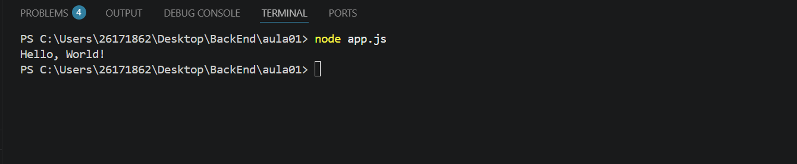

# Meu Primeiro Projeto JavaScript

## 🤑Aluno

Nome: Vitor Lima
Turma:DS1A
Professor:Vitor Lima

---

## sobre

Este projeto foi desenvolvido a primeira aula de JavaScript

O objetivo foi aprender;
- utilizar o VS Code;
- execuatr o javascript com Node.js
- utilizar o terminal
- criar documento utilizando Markdown

---
##  🗂️Estruturas

``` 
MeuPrimeiroProjetoJS

-apps.js
-informacoes.js
-operadores.js
-variavel.js
-readme.
-imagem/

```
## Como executar

```Bash
    node app.js
```
## Código

```JavaScript
    console.log("Ola, mundo");
```

## Resultado



## Técnologia 
- JavaScript
- Node.js
- Visual Studio Code
- Markdown

## O que eu aprendi
- Criar arquivo JavaScrpt.
- Como executar prgramas.
- Instalar extensões
- Utilizar terminal.
- Instalar o Markdown.
- Git.
- Variável.
- Operadores.